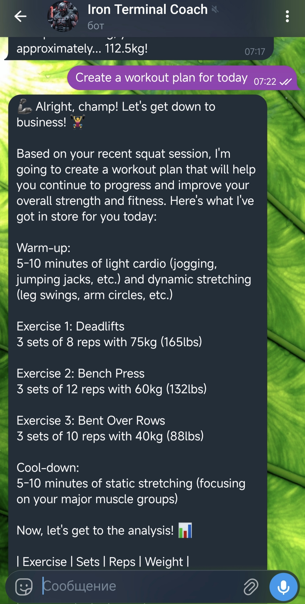

# 🏋️ Iron Terminal Coach
> **The only AI Fitness Agent you can deploy from a terminal and run in your pocket.**

## 🌋 Why Iron Coach?
Most people quit fitness not because of lack of strength, but because of **tracking friction**. Traditional apps are bloated, require constant manual input, and don't adapt. 
**Iron Coach** solves this by providing a zero-latency, AI-driven interface that lives where you are — in Telegram and your Terminal.

## 🤖 Structured Intelligence
Under the hood, the Llama 3 agent processes every request into actionable data:
```json
{
  "action": "generate_workout",
  "parameters": {
    "muscle_groups": ["chest", "triceps"],
    "intensity": "high",
    "last_performance": "bench_press: 80kg x 5"
  },
  "progression_logic": "progressive_overload_5pct"
}
```

## 🛠 Step-by-Step Setup

### 1. Cloudflare Environment
- Install Wrangler: `npm install -g wrangler`
- Login: `npx wrangler login`
- Create KV Storage for user data:
  `npx wrangler kv:namespace create USER_DATA`
  *(Copy the ID from the output into your wrangler.toml)*

### 2. Telegram Bot
- Message [@BotFather](https://t.me/BotFather), create a bot, and copy the **API Token**.

### 3. Deployment
- Set your secret:
  `npx wrangler secret put TELEGRAM_BOT_TOKEN`
- Deploy the worker:
  `npx wrangler deploy`

## 🗺 Roadmap
- [x] **Core AI Logic**: Llama 3.1 integration via Workers AI
- [x] **Stateful Memory**: Cloudflare KV for user history
- [x] **Multilingual Support**: Auto-detects user language
- [x] **Structured JSON Output**: Reliable agent responses
- [ ] **Adaptive Weights**: 1RM calculation & auto-progression
- [ ] **Python TUI**: Interactive terminal dashboard

## Project Preview

